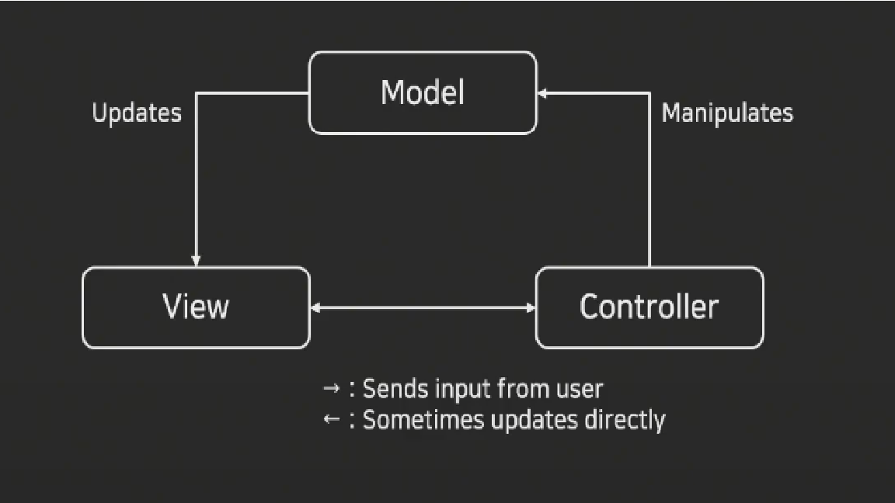

## MVC 패턴이란?
- 소프트웨어 디자인 패턴의 한 종류로 프로그램의 구성을 모델-뷰-컨트롤러로 나누어 둔것을 의미한다.
- 사용자 인터페이스와 비즈니스 로직을 분리하여 개발할 수 있다

## 1. Controller
> 사용자에게 요청을 받아 처리, 응답(view)를 반환하거나 모델에게 요청을 보냄

## 2. Model
> 컨트롤러의 요청을 받아 DataBase에서 정보를 가져오거나 업데이트 해준다. 
> DB에서 가져온 정보를 Controller에게 반환해준다.

## 3. View
> 사용자에게 보여줄 정보를 가져와 사용자에게 전달한다.
